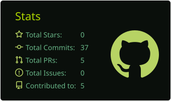
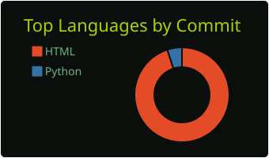
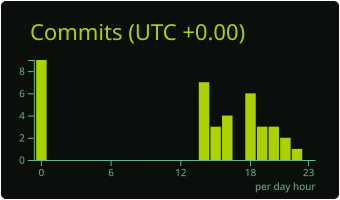

<!-- ============================================================
  README DE PERFIL — Lucas  |  versão HACKER / TERMINAL
  Como usar:
  1. Repositório PÚBLICO com o MESMO nome do seu usuário do GitHub.
  2. Cole este arquivo como README.md nesse repositório.
  3. Troque SEU_USUARIO e SEU_EMAIL.
  4. Adicione os dois workflows em .github/workflows/ (cards + snake)
     e rode-os uma vez em Actions > Run workflow.
============================================================ -->


<div align="center">

[](https://github.com/SEU_USUARIO)


</div>

---

## `> cat sobre_mim.yml`

```yaml
nome: Lucas Hora
local: Rio de Janeiro, Brasil
area: Análise de dados & Business Intelligence (setor de energia)
formacao: Tecnologia em TI — UFF (último ano)

o_que_eu_faco:
  - Transformo bases complexas em painéis claros e KPIs
  - Automatizo processos e relatórios repetitivos
  - Construo ferramentas internas sob medida (HTML/JS + SharePoint)
  - Crio meus próprios jogos nas horas vagas

filosofia: "soluções simples, autocontidas e que funcionam de verdade"
                # muitas vezes 1 único arquivo HTML/JS, abre no navegador, zero instalação

fora_da_tela: [corrida, treino, trilhas, jogos]
estudando: "sempre algo novo em dados e desenvolvimento"
```

---

## `> ls ~/stack`

<details open>
<summary><b>[+] dados_e_bi/</b> &nbsp;<sub>(clique para abrir/fechar)</sub></summary>
<br/>


</details>

<details open>
<summary><b>[+] desenvolvimento/</b></summary>
<br/>


</details>

<details open>
<summary><b>[+] plataformas/</b></summary>
<br/>


</details>

---

## `> ls -la ~/projetos`

<table>
  <tr>
    <td width="50%" valign="top">

**📁 frota-fantasma/**

Jogo de **batalha naval** em português, feito para rodar direto no navegador, sem instalação. Interface própria, partidas rápidas e visual temático.

`JavaScript` `HTML` `CSS`

➜ [`./abrir`](https://github.com/SEU_USUARIO/frota-fantasma)

</td>
    <td width="50%" valign="top">

**📁 painel-backlog/**

Painel **kanban em arquivo único** para gestão de backlog de times, com filtros, status e visão por responsável. Funciona offline e pode integrar com SharePoint.

`JavaScript` `HTML` `SharePoint`

➜ [`./abrir`](https://github.com/SEU_USUARIO/NOME_DO_REPO)

</td>
  </tr>
  <tr>
    <td width="50%" valign="top">

**📁 projeto-3/**

Descreva em uma ou duas frases o que o projeto resolve e por que ele é legal.

`Tecnologia` `Tecnologia`

➜ [`./abrir`](https://github.com/SEU_USUARIO/NOME_DO_REPO)

</td>
    <td width="50%" valign="top">

**📁 projeto-4/**

Descreva em uma ou duas frases o que o projeto resolve e por que ele é legal.

`Tecnologia` `Tecnologia`

➜ [`./abrir`](https://github.com/SEU_USUARIO/NOME_DO_REPO)

</td>
  </tr>
</table>

---

## `> git stats --me`

<div align="center">

<!-- Cards gerados pelo GitHub Action profile-summary-cards.yml (ficam salvos no seu repositório) -->



<br/>


<br/>



</div>

### `> ./snake.sh` &nbsp;<sub>🐍 comendo minhas contribuições</sub>

<div align="center">

<!-- Gerado pelo GitHub Action snake.yml (branch "output") -->


</div>

---

## `> ./contato.sh`

<div align="center">

[](https://www.linkedin.com/in/lucas-hora-800a28170)
[](mailto:SEU_EMAIL)
[](https://instagram.com/dxhora)

<br/>

```bash
$ echo "Dados sem contexto são só números. Com contexto, viram decisão."
```

</div>


