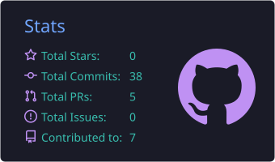
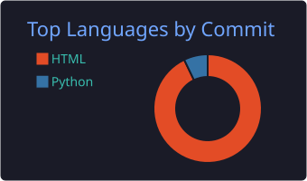
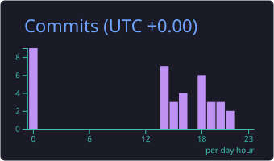

 

---

## 👋 About me

I'm a **data analyst and BI developer** based in Rio de Janeiro, currently working at **Vibra Energia**, one of Brazil's largest energy companies. I turn complex datasets into clear dashboards, automate repetitive processes and build internal tools that save teams real time.

I like solutions that are **simple, self-contained and actually work**, often a single HTML/JS file anyone can open in a browser with nothing to install.

- 📊 Business analysis, dashboards and reporting automation
- 🧪 Data science with Python and Pandas
- 🔌 REST APIs, SQL and data lake pipelines
- 🎓 Final year of the Computer Technology degree at **UFF** (Universidade Federal Fluminense)
- 🌱 Always learning something new in data and software development

---

## 🧰 Tech stack

| Area | Technologies |
|:--|:--|
| **Data Science & Analytics** |     |
| **BI & Low-code** |     |
| **Data Engineering** |     |
| **Development** |      |
| **Tools & Practices** |       |

---

## 🚀 Featured projects

Four projects that show my range, from quick wins to a full data platform.

<table>
  <tr>
    <td width="50%" valign="top">

### 🟢 Basic · Data Cleaning & EDA Toolkit
A reusable **Python + Pandas** toolkit that ingests messy CSV/Excel files, cleans and validates them, and generates an exploratory analysis report with charts.

`Python` `Pandas` `Jupyter` `Data Viz`

[🔗 View repository](https://github.com/horaguimaraes/data-cleaning-eda-toolkit)

</td>
    <td width="50%" valign="top">

### 🟢 Basic · Backlog Kanban Board
A **single-file kanban** for team backlog management, with filters, statuses and per-owner views. Runs offline in any browser and can sync with SharePoint.

`JavaScript` `HTML` `CSS` `SharePoint`

[🔗 View repository](https://github.com/horaguimaraes/backlog-kanban)

</td>
  </tr>
  <tr>
    <td width="50%" valign="top">

### 🟡 Intermediate · Fuel Prices Analytics API
An **ETL + REST API** that loads public fuel price data into a SQL database and serves it through a typed **TypeScript / Node.js** API, with a **Power BI** report on top.

`TypeScript` `Node.js` `SQL` `REST API` `Power BI`

[🔗 View repository](https://github.com/horaguimaraes/fuel-prices-analytics-api)

</td>
    <td width="50%" valign="top">

### 🔴 Advanced · Data Lake & Demand Forecasting Platform
An end-to-end **data platform**: raw → clean → curated layers (medallion architecture) in a data lake, orchestrated pipelines, a **machine learning forecasting model**, a REST API for serving predictions, CI/CD and a Power BI dashboard.

`Python` `Data Lake` `SQL` `Machine Learning` `REST API` `Docker` `GitHub Actions` `Power BI`

[🔗 View repository](https://github.com/horaguimaraes/datalake-forecasting-platform)

</td>
  </tr>
</table>

---

## 💼 Experience

| Period | Role | Focus |
|:--|:--|:--|
| **Aug 2024 – Present** | **Senior Administrative Assistant** · Vibra Energia | Business analysis and data analysis: dashboards, reporting automation and internal tools |
| **Aug 2023 – Aug 2024** | **Intern** · Vale | Hybrid role supporting analysis and reporting in a global mining company |
| **Dec 2022 – May 2023** | **Technology Intern** · Floki | Software and technology support |
| **Aug 2021 – Jul 2022** | **Intern** · BTG Pactual | Excel, VBA, SQL, Python and Power BI for financial analysis and automation |
| **Sep 2020 – Mar 2021** | **Computer Science Intern** · Pentágono S.A. DTVM | Excel and Office 365 for financial operations |

## 🎓 Education

**Technologist degree in Computer Technology** · Universidade Federal Fluminense (UFF) · 2021 – present (final year)

## 📜 Selected certifications

<b>Data, AI & Cloud</b>

- Python for Data Science: Foundations (LinkedIn)
- Advanced Python Techniques (LinkedIn)
- Artificial Intelligence Foundations: Machine Learning (LinkedIn)
- Big Data and Artificial Intelligence: The Power of Data (LinkedIn)
- SQL Essential Training (LinkedIn)
- Database Foundations: Administration (LinkedIn)
- Microsoft Power Platform Fundamentals (PL-900) Cert Prep: Power BI (LinkedIn)
- Cloud Computing Fundamentals (LinkedIn)

<b>Software development & practices</b>

- JavaScript: Foundations (LinkedIn)
- TypeScript Essential Training (LinkedIn)
- TypeScript for Node.js Developers (LinkedIn)
- DevOps Foundations (LinkedIn)
- Advanced Scrum Techniques (LinkedIn)

<b>Finance & compliance</b>

- FIDC: Credit Rights Investment Funds (ANBIMA), Jul 2022
- LGPD Compliance: Impact on Brazilian Companies (LinkedIn)

---

## 📊 GitHub stats

 

 

---

## 📫 Let's connect

I'm open to conversations about data, BI and automation.

 

*"Data without context is just numbers. With context, it becomes a decision."*

